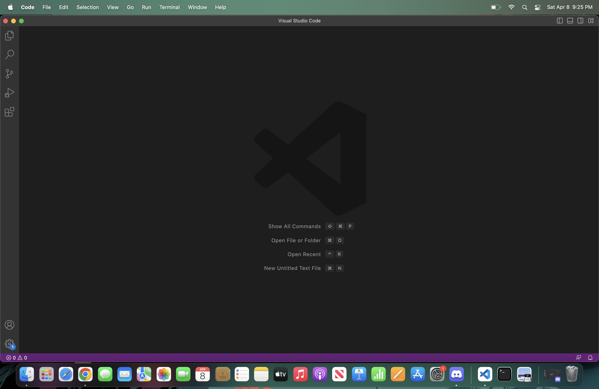
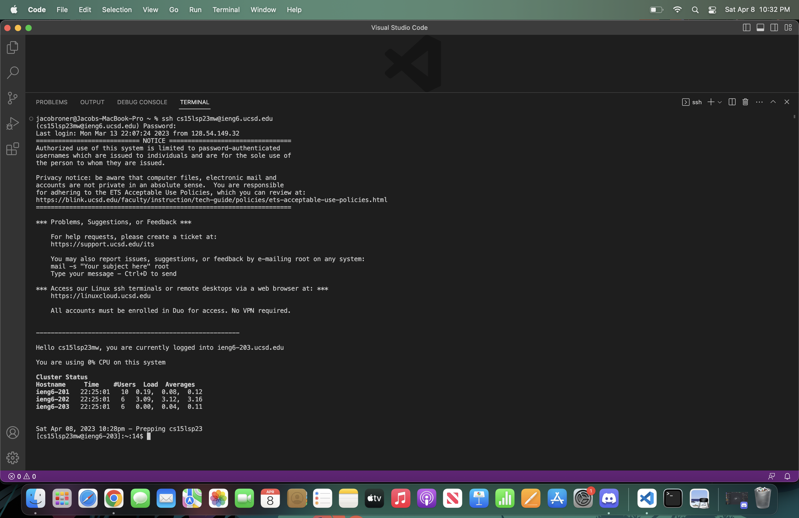
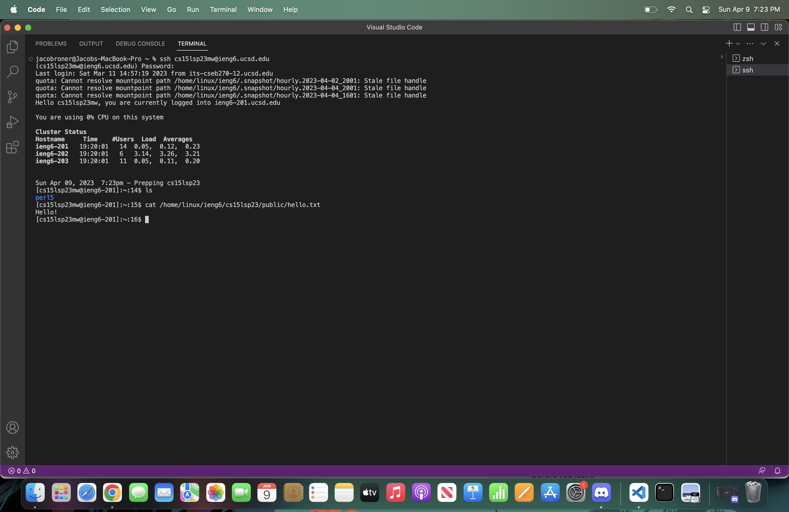

# Lab Report 1 - Jacob Roner
---

This tutorial will demonstrate how to log into a course-specific account on ieng6. (Screenshots taken on MAC)

## Install VSCode
Download and install VScode from [here.](https://code.visualstudio.com/download) If you are working on windows, you will also need to install Git. 
Once VScode is installed, open it so that you get to this screen:
 

 
Now open a new terminal by selecting the "new terminal" button under the "terminal" tab at the top left of the screen.
 
## Remotely Connecting
 
To remotely connect you must first make sure a password has been set for your UCSD CSE 15l username.
Got to [this](https://sdacs.ucsd.edu/~icc/index.php) link and reset your password.
 
Once you have reset your password, Type the following command into the terminal (do not include the '$' and replace the 'cs15lsp23zz' with your username):

**$ ssh cs15lsp23zz@ieng6.ucsd.edu**
 
If it is your first time logging in, the terminal may prompt you about the authenticity of the connection. Type 'yes' and hit enter. To leave the remote connection, type 'exit' into the terminal.
Once you have logged in, your terminal should look like this:
 

 
## Trying Some Commands
Now that you have connected to the server you can run some commands!
To enter a command, type it into the terminal and hit enter. Remember that the school server will only allow access to certain files, not all commands may work.
Your commands in the terminal should look something like this:
 

Here are a list of some terminal commands:

- cd ~
- cd
- ls -lat
- ls -a
- ls <directory>
- cp
- cat
 
 
 
 
