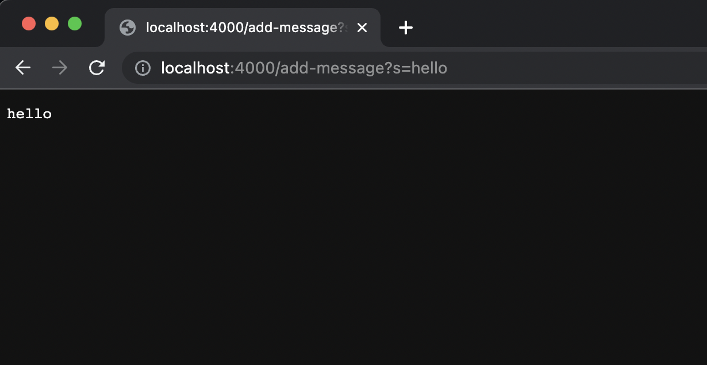
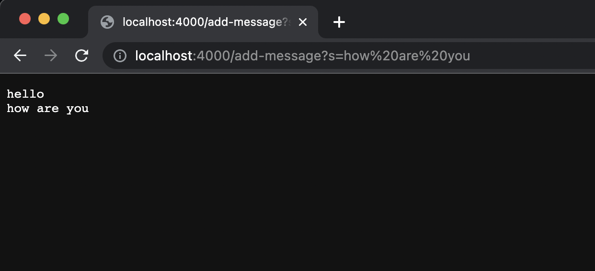
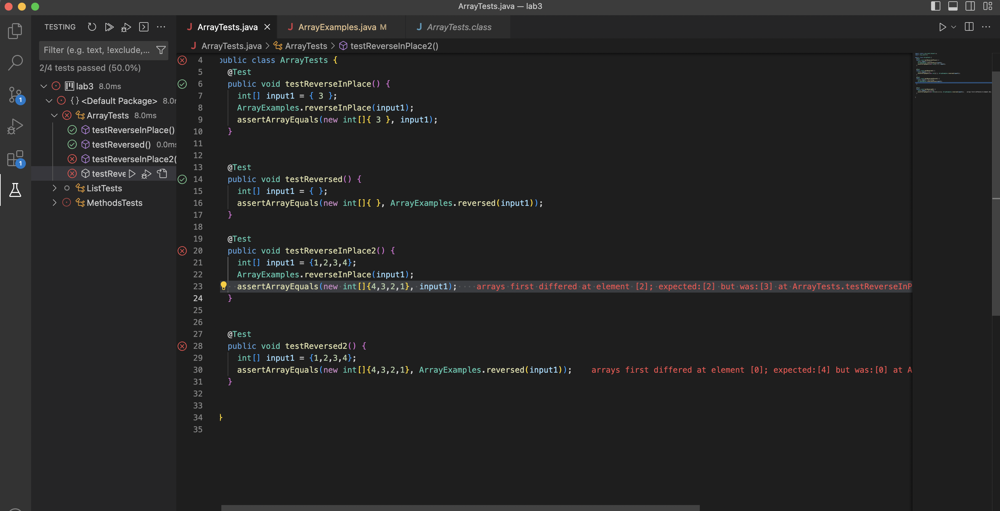

# Lab Report 2 - Jacob Roner
---

## Part 1

Code for StringSearch:

```
import java.io.IOException;
import java.net.URI;
import java.util.ArrayList;

class Handler implements URLHandler {

    String words = "";

    public String handleRequest(URI url) {
        System.out.println("Path: " + url.getPath());
        if (url.getPath().contains("/add-message")) {
            String[] parameters = url.getQuery().split("=");
            if (parameters[0].equals("s")) {
                words = (words + parameters[1] + "\n");
                return words;
            }
        }
            return "404 Not Found!";
    
    }
}

class StringSearch {
    public static void main(String[] args) throws IOException {
        if(args.length == 0){
            System.out.println("Missing port number! Try any number between 1024 to 49151");
            return;
        }

        int port = Integer.parseInt(args[0]);

        Server.start(port, new Handler());
    }
}

```


**Using "/add-message":**



- when "http://localhost:4000/add-message?s=hello" is entered, the **handleRequest** method is called.

- The **Handler** class has one relevent field of type String: **words**. The method takes a single argument: the given URL. The method then takes the path of the url and adds the string at the end to the **words** String.
- The value of the String **words** gets updated with the new string everytime, and is the only value that gets changed




- when "http://localhost:4000/add-message?s=how%are%you" is entered, again, the **handleRequest** method is called.

- The **Handler** class has one relevent field of type String: **words**. The method takes a single argument: the given URL. The method then takes the path of the url and adds the string at the end to the **words** String.
- The value of the String **words** gets updated with the new string everytime, and is the only value that gets changed


## Part 2

Buggy program: **ArrayExamples**

**Failure inducing input:**
```
  @Test 
  public void testReverseInPlace2() {
    int[] input1 = {1,2,3,4};
    ArrayExamples.reverseInPlace(input1);
    assertArrayEquals(new int[]{4,3,2,1}, input1);
	}


  @Test
  public void testReversed2() {
    int[] input1 = {1,2,3,4};
    assertArrayEquals(new int[]{4,3,2,1}, ArrayExamples.reversed(input1));
  }
  ```

**Non-Failure inducing input**
```
	@Test 
	public void testReverseInPlace() {
    int[] input1 = { 3 };
    ArrayExamples.reverseInPlace(input1);
    assertArrayEquals(new int[]{ 3 }, input1);
	}


  @Test
  public void testReversed() {
    int[] input1 = { };
    assertArrayEquals(new int[]{ }, ArrayExamples.reversed(input1));
  }
  ```
  
  **Symptoms from tests:**
  
  
  
  
  
  **Buggy program before fix:**
  ```
  public class ArrayExamples {

  // Changes the input array to be in reversed order
  static void reverseInPlace(int[] arr) {
    for(int i = 0; i < arr.length; i += 1) {
      arr[i] = arr[arr.length - i - 1];
    }
  }

  // Returns a *new* array with all the elements of the input array in reversed
  // order
  static int[] reversed(int[] arr) {
    int[] newArray = new int[arr.length];
    for(int i = 0; i < arr.length; i += 1) {
      arr[i] = newArray[arr.length - i - 1];
    }
    return arr;
  }

  // Averages the numbers in the array (takes the mean), but leaves out the
  // lowest number when calculating. Returns 0 if there are no elements or just
  // 1 element in the array
  static double averageWithoutLowest(double[] arr) {
    if(arr.length < 2) { return 0.0; }
    double lowest = arr[0];
    for(double num: arr) {
      if(num < lowest) { lowest = num; }
    }
    double sum = 0;
    for(double num: arr) {
      if(num != lowest) { sum += num; }
    }
    return sum / (arr.length - 1);
  }
}
 ``` 
  
  
  
  
  **Buggy program after fix:**
  ```
  public class ArrayExamples {

  // Changes the input array to be in reversed order
  static void reverseInPlace(int[] arr) {
    for(int i = 0; i < arr.length/2; i += 1) {
      int temp = arr[i];
      arr[i] = arr[arr.length - i - 1];
      arr[arr.length - i - 1] = temp;
    }
  }

  // Returns a *new* array with all the elements of the input array in reversed
  // order
  static int[] reversed(int[] arr) {
    int[] newArray = new int[arr.length];
    for(int i = 0; i < arr.length; i += 1) {
       newArray[arr.length - i - 1] = arr[i];
    }
    return newArray;
  }

  // Averages the numbers in the array (takes the mean), but leaves out the
  // lowest number when calculating. Returns 0 if there are no elements or just
  // 1 element in the array
  static double averageWithoutLowest(double[] arr) {
    if(arr.length < 2) { return 0.0; }
    double lowest = arr[0];
    for(double num: arr) {
      if(num < lowest) { lowest = num; }
    }
    double sum = 0;
    int counter = 0;
    for(double num: arr) {
      if(num != lowest) { sum += num; }
      if(num == lowest){counter++;}
    }
    return sum / (arr.length - counter);
  }
}
```

In the ArrayExamples program, both the **reversed** and the **reverseinplace** methods were broken.

In order to fix the **reverseinplace** method, the for loop had
be adjusted to only iterate half the length of the list. In addition, a temp variable had to be added to make sure that the values of the loop are properly swaped.

To fix the **reversed** method, the inside of the for loop had to be changed in order to make each iteration add the element from the old array into the new array
and not the other way around.


## Part 3

In the lab for week 2 I learned how to create and access servers. I had never hosted my own server before, let alone from a terminal. It was fun to learn how to create the code required to 
set up a server, and make the code required to modify a webpage based on its URL. Lab 2 taught me a lot about servers and URLs

Although I had already had an introduction to JUnit through CSE 12, Week 3 lab tought me more about how to properly use Junit to diagnose and solve problems. I learned how to debug and solve problems in
code that I did not orignially make.

