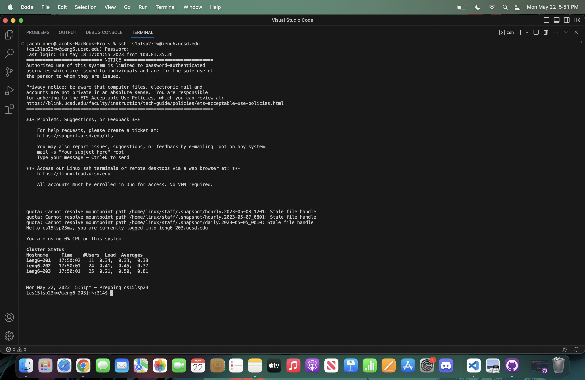
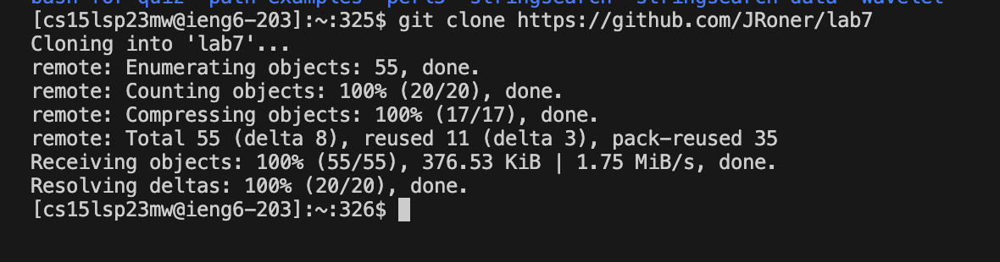
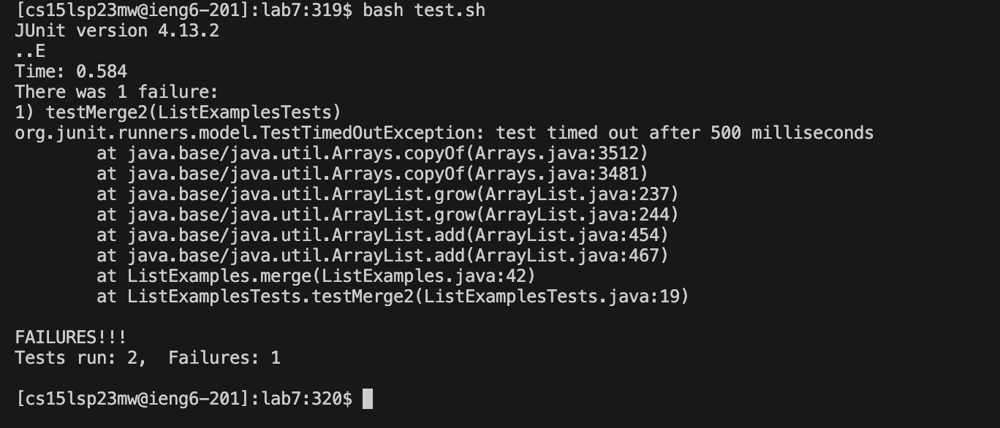
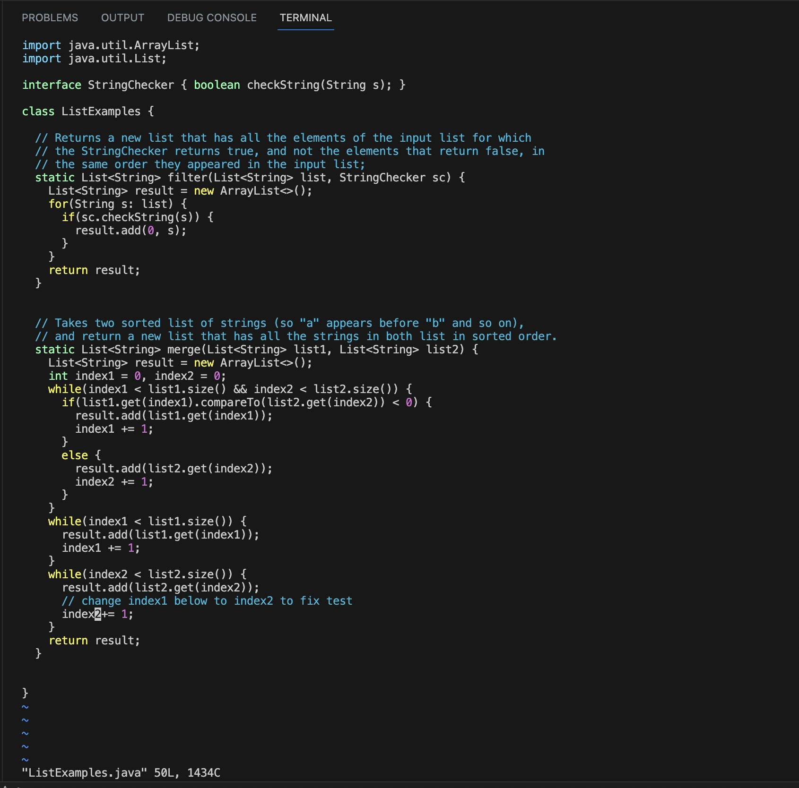
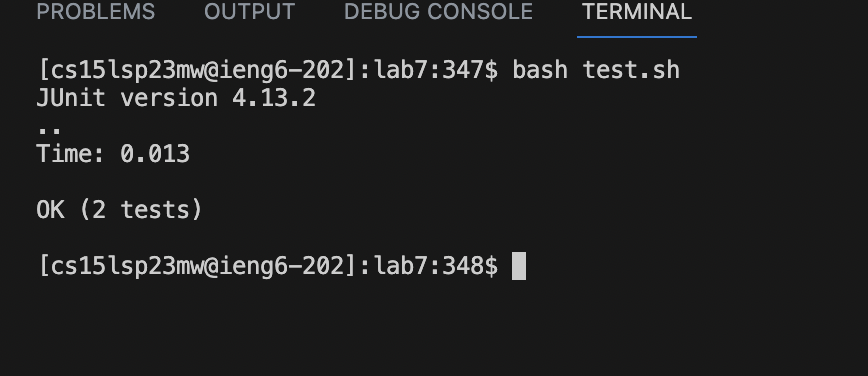
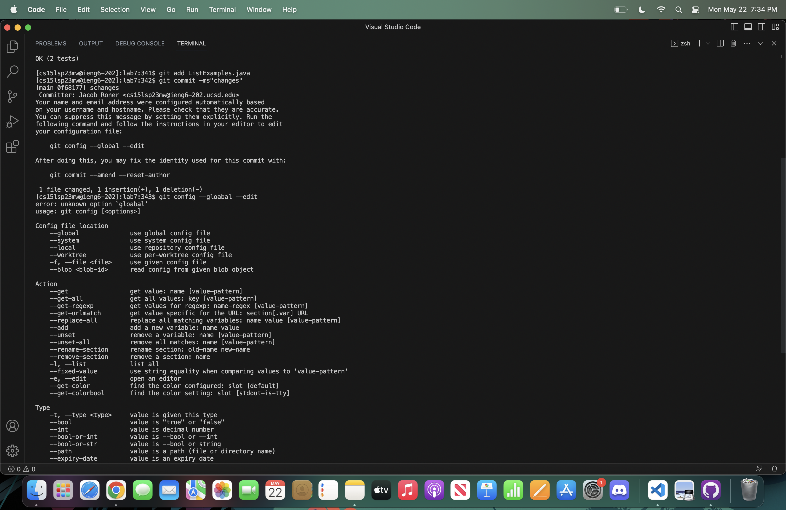
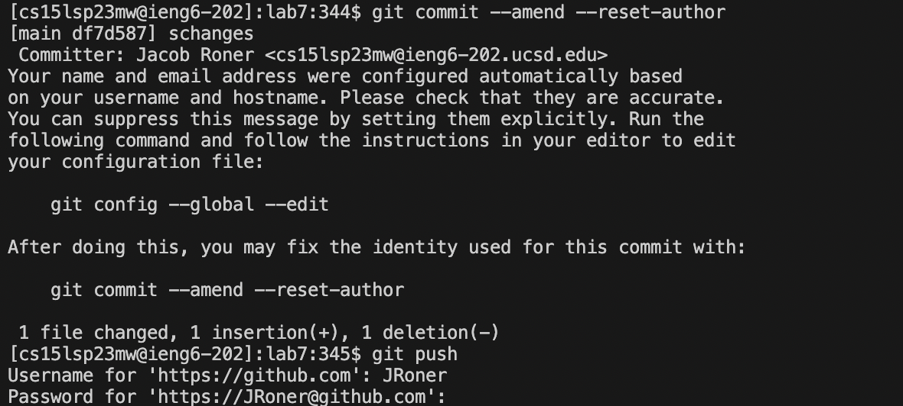

# Lab Report 4 - Jacob Roner
---

## 1. Log into ieng6

- In the terminal, type in:
```
ssh cs15lsp23mw@ieng6.ucsd.edu
```
- Keys pressed:  ```"ssh cs15lsp23mw@ieng6.ucsd.edu" <enter> ```




## 2. Clone your fork of the repository form tour Github account

- after setting up a fork on your GitHub account, type this command into the terminal with the fork url in the blank:

```
git clone ___________
```
- Keys pressed:  ```"git clone https://github.com/JRoner/lab7" <enter> ```



## 3. Run the test, demonstrating that they fail

- enter the lab7 directory with the "cd lab7" command
- to run the test file, use:
```
bash test.sh
```
- The tests will fail, showing that there is an error in the code
- Keys pressed:  ```"bash test.sh" <enter> ```



## 4. Edit the code file to fix the failing test

- Open the file in vim with: vim ListExamples.java
- Hold ```J``` key until at the start of the last line that says “index1 += 1;". This will move the to the location in which the change needs to be made.
- Enter “1e” while in normal mode. This command will move the cursor to the end of the first word.
- Press ```x```. This will remove the character that the cursor is on.
- Press ```I```. "I" will enter into insert mode.
- Type ```2```. While in insert mode, this will insert a "2" in order to replace the previous "1"
- Press ```<esc>``` button. This command will exit out of Insert Mode into Normal Mode.
- Type “:wq”. This command will save the file and exit edit mode.




## 5. Run the tests, demonstrating that they now succeed

- to run the test file, press ```<up>``` until the previous bash test command is in the command line.
- Keys pressed:  ```<up>``````<up>``````<up>``````<up>``````<up>``````<enter>```



## 6. Commit and push the resulting change to your Github account

- Enter the following commands:

To add the edited file:
```
git add ListExamples.java
```
To prepare the commit:
```
git commit -ms "Changes"
```


To Push to orgin:
```
git push -u orgin main
```


- These commands will take all the changes that were made and push them to the orgin on GitHub, thus saving the changes that you made to the original save.


