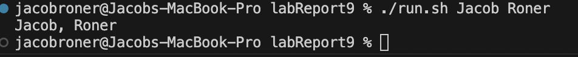
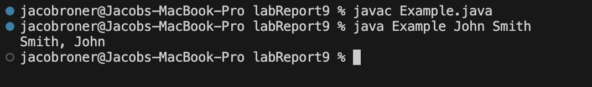
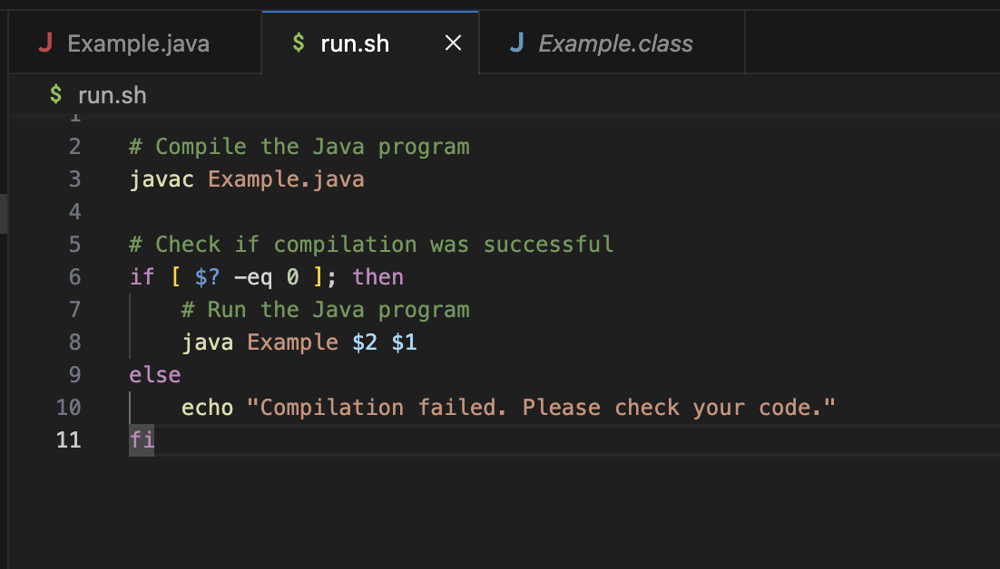
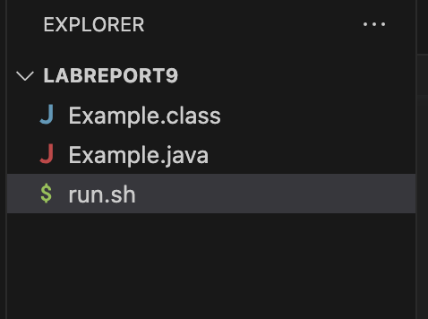

# Lab Report 5 - Jacob Roner
---

## Part 1 - Debugging Scenario

---

## 1. Student Post:
```
What environment are you using (computer, operating system, web browser, terminal/editor, and so on)?

  I am using VScode terminal to run a bash script that compiles and runs my code from Example.java

Detail the symptom you're seeing. Be specific; include both what you're seeing and what you expected 
to see instead. Screenshots are great, copy-pasted terminal output is also great. Avoid saying “it 
doesn't work”.

  My program is supposed to take a name as an input from the command line and reformat it. For example,
  the name "Jacob Roner" should be formated as "Roner, Jacob". The bash script(run.sh) is set up to 
  tell me if the program fails to compile, but it runs fine. The problem is that the output is given as
  "Jacob, Roner" which is the wrong order. I keep searching my code but I dont see a problem.

Detail the failure-inducing input and context. That might mean any or all of the command you're running,
a test case, command-line arguments, working directory, even the last few commands you ran. Do your best 
to provide as much context as you can.

  I am running the bash sript as "./run.sh Jacob Roner" and I am getting an output of "Jacob, Roner". 
  All of this is being done in the same directory. It seems as though the bash script has no problems.

```
Student's failed output:



## 2. TA Response:
```
Interesting problem!

Before you assume that your code is broken, you need to be sure that the bash script is not causing a problem.
Try running the program with out using the bash script.

Use these commands in your terminal:
  javac Example.java
  java Example John Smith
  
Your output should be: Smith, John
If you get the right output, the problem is most likely with your bash script and not your code.

```

## 3. Student's Results and Response:



```
It seems as though the problem is with the bash script after all. When I ran the coude in the terminal, it worked!
I cant seem to find a problem with my bash script, it seems to run the file with the given inputs.

Below I attached a screenshot of the bash script, where do I need to look?

```



## 4. TA Final Response:
```
The problem seems to be not with how the file is compiled, but with how it is called.

Take a closer look at the way in which you establish the arguments from the terminal into the bash script. 
Is the order correct?

```

## 5. Setup Information:

- The file & directory structure:
  
  
- The contents of each file before fixing the bug:

   Example.java:
   ```
   public class Example{
    public static void main(String args[]){
        String first = args[0];
        String last = args[1];
        System.out.println(last + ", " + first);
    }
   } 
   ```
   
   run.sh:
   ```
   
  # Compile the Java program
  javac Example.java

  # Check if compilation was successful
  if [ $? -eq 0 ]; then
      # Run the Java program
      java Example $2 $1
  else
      echo "Compilation failed. Please check your code."
  fi
   ```
   
- The full command line (or lines) you ran to trigger the bug:
    ```
    ./run.sh Jacob Roner
    ```
    and
    ```
    javac Example.java
    java Example John Smith
    ```
    
-A description of what to edit to fix the bug:
  ```
  The bug is a problem with the way the bash script was constucted.
  To fix the bug, the order of ``` $2``` and ```$1``` need to be
  swaped on line 8 of the run.sh script. 
  
  Essentially, the bug was causing the program to run with the arguments in
  a swaped order. This made the code appear to run incorrectly even though it
  worked perfectly fine.
  ```
    
